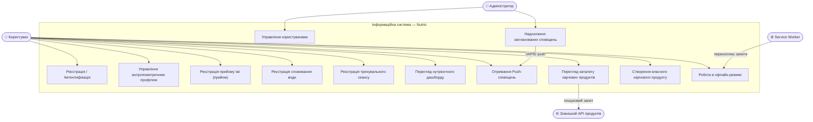
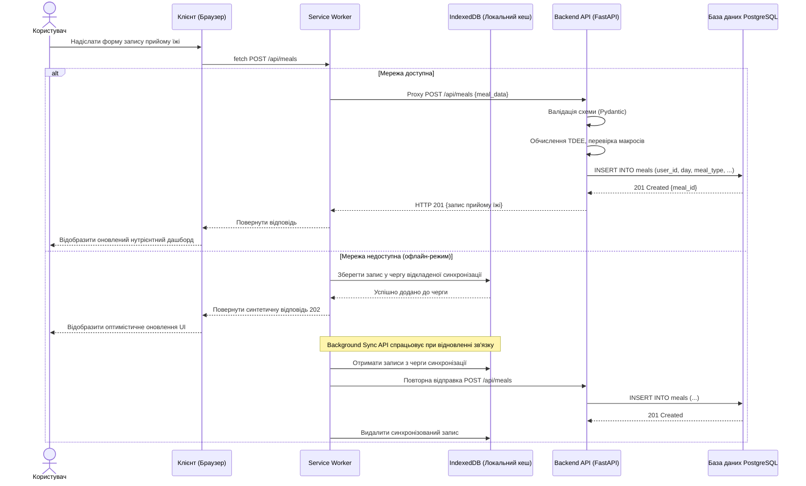
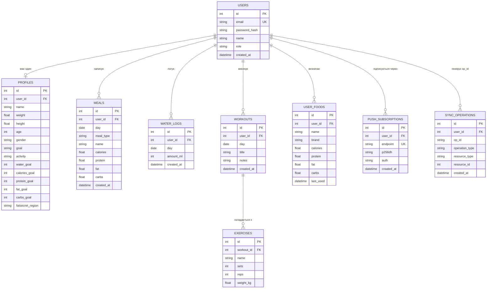
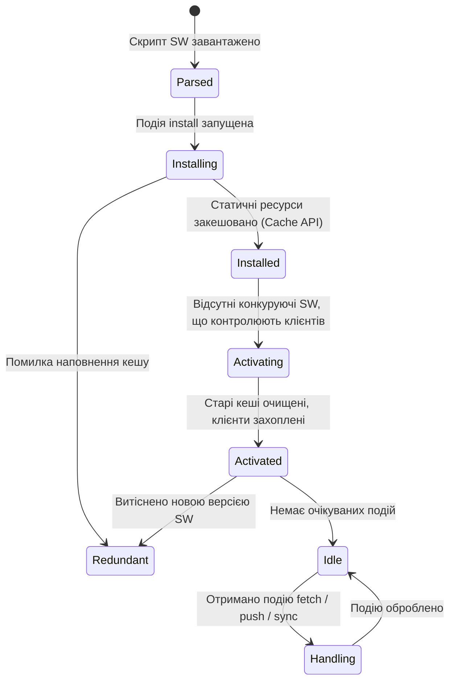
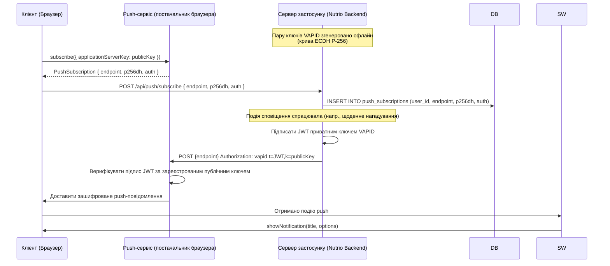

# Інформаційна система моніторингу нутрієнтного балансу на базі архітектури прогресивного веб-застосунку (PWA)

**Назва проєкту:** Nutrio  
**Класифікація:** Об'єкт дослідження бакалаврської / магістерської кваліфікаційної роботи  
**Предметна область:** Інформаційні системи · Взаємодія людини з комп'ютером · Прикладна нутриціологічна інформатика  
**Поточний стан:** активна розробка, інтеграційна гілка `dev`, безперервна інтеграція через GitHub Actions (`backend: ruff + pytest`, `frontend: vitest + build`).

---

> Цей документ є формальною технічною специфікацією програмного рішення *Nutrio* — розподіленої клієнт-серверної інформаційної системи, призначеної для автоматизованого збору, обробки та аналітичної оцінки даних щодо індивідуального нутрієнтного балансу. Система інтегрує сучасні практики веб-інженерії з перевіреними емпіричними метаболічними моделями і є основним дослідницьким артефактом у галузі проєктування прогресивних веб-застосунків (PWA).

---

## Зміст

1. [Математичне підґрунтя та алгоритми](#1-математичне-підґрунтя-та-алгоритми)
2. [Моделювання системи та UML-діаграми](#2-моделювання-системи-та-uml-діаграми)
3. [Технічна архітектура (акцент на PWA)](#3-технічна-архітектура-акцент-на-pwa)
4. [Середовище розробки та DevOps](#4-середовище-розробки-та-devops)
5. [Методологія верифікації та тестування](#5-методологія-верифікації-та-тестування)

---

## 1. Математичне підґрунтя та алгоритми

Аналітичне ядро інформаційної системи ґрунтується на загальновизнаних емпіричних моделях оцінювання енергетичних потреб організму людини. Математична формалізація цих моделей становить теоретичну основу для всіх персоналізованих дієтичних рекомендацій, що генеруються системою.

### 1.1 Базовий рівень метаболізму — рівняння Міффліна-Сан Жеора

Базовий рівень метаболізму (BMR) відображає мінімальні витрати енергії, необхідні для підтримання життєво важливих фізіологічних функцій у стані спокою. У системі реалізоване **рівняння Міффліна-Сан Жеора** (1990), яке демонструє вищу прогностичну валідність порівняно з більш ранніми моделями, зокрема моделлю Харріса-Бенедикта.

Уніфікований формальний запис:

$$BMR = 10w + 6.25h - 5a + s$$

де гендерна стала $s$ визначається як кускова функція:

$$s = \begin{cases} +5 & \text{якщо стать} = \text{чоловіча} \\ -161 & \text{якщо стать} = \text{жіноча} \end{cases}$$

**Легенда змінних:**

| Символ | Одиниця | Опис |
|--------|---------|------|
| $w$ | кг | Маса тіла суб'єкта |
| $h$ | см | Зріст суб'єкта |
| $a$ | роки | Хронологічний вік суб'єкта |
| $s$ | ккал/добу | Гендерно-специфічний метаболічний інтерцепт |

### 1.2 Загальна добова потреба в енергії (TDEE)

Загальна добова потреба в енергії (TDEE) визначається шляхом масштабування значення BMR на коефіцієнт фізичної активності $K_{act}$, що моделює сукупні метаболічні витрати на добове фізичне навантаження:

$$TDEE = BMR \cdot K_{act}$$

Коефіцієнт активності $K_{act}$ береться з наступної стандартизованої таблиці відповідностей, що зберігається як конфігураційна сутність системи:

| Рівень активності (поле `activity`) | $K_{act}$ | Опис |
|---|---|---|
| `sedentary` | 1.2 | Мінімальна або відсутня фізична активність |
| `light` | 1.375 | Легкі навантаження 1–3 дні/тиждень |
| `medium` | 1.55 | Помірні навантаження 3–5 днів/тиждень |
| `active` | 1.725 | Інтенсивні навантаження 6–7 днів/тиждень |
| `very_active` | 1.9 | Професійний спортсмен або фізична праця |

### 1.3 Цільовий калорійний баланс з урахуванням мети

Система застосовує детерміновану коригувальну функцію до значення TDEE на підставі задекларованої фізіологічної мети користувача (поле `goal` сутності `Profile`):

$$C_{target} = TDEE \cdot \delta_{goal}$$

$$\delta_{goal} = \begin{cases} 0.85 & \text{якщо мета} = \text{схуднення} \\ 1.00 & \text{якщо мета} = \text{підтримання ваги} \\ 1.15 & \text{якщо мета} = \text{набір маси} \end{cases}$$

### 1.4 Алгоритм розподілу макронутрієнтів

Після обчислення $C_{target}$ система визначає оптимальний розподіл макронутрієнтів за умови, що сума часток калорійного внеску дорівнює одиниці. Розподіл моделюється як система лінійних обмежень:

$$\alpha_p + \alpha_f + \alpha_c = 1$$

$$P_{g} = \frac{C_{target} \cdot \alpha_p}{4}, \quad F_{g} = \frac{C_{target} \cdot \alpha_f}{9}, \quad C_{g} = \frac{C_{target} \cdot \alpha_c}{4}$$

де $\alpha_p$, $\alpha_f$, $\alpha_c$ — встановлені протоколом відсоткові частки для білків, жирів та вуглеводів відповідно (калорійна щільність: білки = 4 ккал/г, жири = 9 ккал/г, вуглеводи = 4 ккал/г). Обчислені значення $P_g$, $F_g$, $C_g$ (у грамах) зберігаються в таблиці `profiles` як `protein_goal`, `fat_goal` та `carbs_goal` відповідно.

---

## 2. Моделювання системи та UML-діаграми

Усі UML-моделі розроблені відповідно до специфікації **UML 2.5.1** та виражені мовою Mermaid DSL для відтворюваного рендерингу в рамках документації під контролем версій.

### 2.1 Діаграма варіантів використання

Наведена діаграма формалізує функціональні вимоги до інформаційної системи, визначаючи акторів та межі їхньої взаємодії з основними модулями системи.



### 2.2 Діаграма послідовності — Реєстрація прийому їжі з офлайн-синхронізацією

Діаграма деталізує часову динаміку обміну повідомленнями під час варіанту використання «Реєстрація прийому їжі», явно моделюючи роль Service Worker як мережевого проксі-шару, що забезпечує транзакційну цілісність за умов нестабільного мережевого зv'язку.



### 2.3 Діаграма «сутність-зв'язок» (ERD)

Наведена ERD відображає фізичну реляційну схему бази даних PostgreSQL інформаційної системи, отриману безпосередньо з визначень ORM-моделей SQLAlchemy та керовану за допомогою версіонованих міграцій Alembic.



Таблиця `sync_operations` забезпечує **ідемпотентність повторних відправок** із офлайн-черги: клієнтський `op_id` (UUIDv4, що генерується на клієнті при першій спробі) + унікальний індекс `(user_id, op_id)` гарантують, що повтор того самого запиту після відновлення мережі не призведе до дублювання записів у `meals`, `water_logs` чи `workouts`. У відповідних роутерах (`POST /nutrition/meal`, `POST /nutrition/water`, `POST /workouts`) колізія `op_id` між різними `resource_type` повертає `409 Conflict` із кодом `OP_ID_CONFLICT`.

---

## 3. Технічна архітектура (акцент на PWA)

Клієнтська підсистема спроєктована відповідно до специфікації **Progressive Web Application**, визначеної робочими групами W3C та WHATWG. Цей архітектурний патерн піднімає інформаційну систему вище обмежень звичайної веб-сторінки, забезпечуючи поведінкові характеристики нативних застосунків: офлайн-роботу, фонову обробку та доставку сповіщень на рівні платформи.

### 3.1 Життєвий цикл Service Worker як компонент надійності системи

**Service Worker** (SW) — це контекст виконання JavaScript, що функціонує в окремому потоці від основного процесу браузера, виступаючи програмованим мережевим проксі. Його життєвий цикл є критичним механізмом надійності інформаційної системи:



**Стратегія кешування:** Система застосовує стратегію **«Кеш — пріоритет, Мережа — резерв»** для статичних ресурсів (HTML-оболонка, CSS, JS-бандли) та стратегію **«Мережа — пріоритет, Кеш — резерв»** для відповідей API, мінімізуючи затримки та забезпечуючи актуальність даних.

**Конфіденційність на спільному пристрої:** під час `logout` Service Worker отримує повідомлення `clearApiCache`, яке видаляє всі закешовані відповіді API — це запобігає витоку приватних даних попереднього користувача (профіль, прийоми їжі, тренування) на сімейному / робочому пристрої при наступному вході під іншим обліковим записом.

### 3.2 Протокол VAPID для безпечної доставки Push-сповіщень

Підсистема проактивних сповіщень реалізована через **Web Push Protocol** (RFC 8030), захищений специфікацією **VAPID** (Voluntary Application Server Identification for Web Push, RFC 8292). VAPID встановлює криптографічно верифіковану ідентичність сервера застосунку, унеможливлюючи несанкціоновану доставку push-повідомлень.

**Протокольний потік:**



Поля `p256dh` та `auth`, що зберігаються в `push_subscriptions`, є клієнтськими ключами шифрування, необхідними серверу застосунку для шифрування корисного навантаження push-повідомлення за протоколом узгодження ключів **ECDH** перед відправкою до Push-сервісу.

### 3.3 Управління схемою бази даних через версіоновані міграції

Еволюція схеми реляційної бази даних керується за допомогою **Alembic** — легковагового фреймворку міграцій для SQLAlchemy. Цей підхід реалізує патерн **Database Migration**, гарантуючи, що зміни схеми є:

- **Детермінованими** — кожна міграція є ідемпотентною, впорядкованою транзакцією.
- **Зворотними** — кожна операція `upgrade()` має відповідний аналог `downgrade()`.
- **Аудитованими** — скрипти міграцій розміщені в директорії `backend/alembic/versions/` під контролем версій Git, формуючи повну, простежувану з точки зору походження історію схеми.

Кожному скрипту міграції присвоюється унікальний ідентифікатор ревізії з посиланням на попередника, утворюючи спрямований ациклічний граф залежностей станів схеми. Таблиця `alembic_version` у виробничій базі даних фіксує поточну застосовану ревізію, гарантуючи консистентність розгортання в усіх середовищах.

---

## 4. Середовище розробки та DevOps

### 4.1 Операційне середовище

| Параметр | Специфікація |
|----------|-------------|
| **ОС** | Fedora / Ubuntu Linux (UNIX-сумісне середовище) |
| **Серверне середовище виконання** | Python 3.12, FastAPI 0.111, Uvicorn ASGI |
| **Клієнтський фреймворк** | React 18 + React Router 6, мова JSX/ESM |
| **Інструмент збірки клієнтської частини** | Vite 5 (збірник ES-модулів) + `vite-plugin-pwa` |
| **Контейнеризація** | Docker, Docker Compose |
| **СУБД** | PostgreSQL 16 (`postgres:16-alpine`) |
| **ORM та міграції** | SQLAlchemy 2.0, Alembic 1.13 |
| **Конвеєр CI** | GitHub Actions (`.github/workflows/ci.yml`): backend `ruff + pytest`, frontend `vitest + build` |

### 4.2 Контроль версій та робочий процес

Управління життєвим циклом вихідного коду здійснюється відповідно до спрощеної моделі **trunk-based development** із короткоживучими feature-гілками:

- `main` — виключно стабільні виробничі релізи; захищена гілка, прямі push заборонені.
- `dev` — інтеграційна гілка для завершеної функціональної роботи; вхідна точка для всіх PR.
- `devin/<timestamp>-<slug>` (або `feature/<slug>`) — ізольовані гілки для окремих функціональних приростів, що зливаються в `dev` через pull-request.

Кожен PR проходить обов'язковий CI-запуск (див. §5). Зливання дозволяється лише після успішного проходження всіх перевірок та code-review.

### 4.3 Локальний запуск

```bash
# 1. Бекенд + база даних через Docker Compose
docker-compose up -d db
cd backend
python -m venv .venv && source .venv/bin/activate
pip install -r requirements-dev.txt
alembic upgrade head           # застосування міграцій до 0009 включно
uvicorn main:app --reload

# 2. Фронтенд (окремий термінал)
cd frontend
npm install
npm run dev                    # http://localhost:5173

# 3. Тести
cd backend && pytest && ruff check .
cd frontend && npm run test -- --run && npm run build
```

Змінні середовища (`backend/.env`): `DATABASE_URL`, `JWT_SECRET`, `GOOGLE_CLIENT_ID`, `VAPID_PUBLIC_KEY`, `VAPID_PRIVATE_KEY`, `GEMINI_API_KEY` — приклади у `backend/.env.example`.

### 4.4 Безпечний віддалений доступ та автентифікація розгортання

Взаємодія з віддаленим репозиторієм та автентифікація в конвеєрі розгортання виконуються виключно через **криптографічну автентифікацію на основі SSH-ключів** (алгоритм Ed25519), що унеможливлює розкриття парольних облікових даних. Приватний ключ зберігається локально в `~/.ssh/` з правами доступу `600`; відповідний публічний ключ зареєстровано на хості віддаленого репозиторію. Ця конфігурація відповідає принципу асиметричної автентифікації як схемі облікових даних з нульовим знанням.

---

## 5. Методологія верифікації та тестування

Стратегія забезпечення якості структурована за трьома рівнями валідації, що відповідають різним рівням ієрархії абстракцій системи. Поточний стан тестового покриття: **91 модульний/інтеграційний тест на бекенді** (`backend/tests/`) та **32 тести на фронтенді** (`frontend/src/**/*.test.{js,jsx}`).

### 5.1 Модульне та інтеграційне тестування бекенду

**Область охоплення:** Ізольована верифікація обчислювальних модулів (§1), CRUD-шару, маршрутизаторів FastAPI, ідемпотентності офлайн-replay, валідації схем.

**Фреймворк:** `pytest` + `httpx.AsyncClient` (in-process FastAPI), `SQLAlchemy` + SQLite-in-memory як тестова СУБД (фікстура `tests/conftest.py`).

**Лінтер:** `ruff check .` (правила: `E`, `F`, `W`, `I`, `B`, `UP`).

**Приклад специфікації тесту:**

```
ID тесту: UT-BMR-001
Вхідні дані:  w=70кг, h=175см, a=25р, стать=чоловіча
Очікуваний результат: BMR = 10(70) + 6.25(175) - 5(25) + 5 = 1723.75 ккал/добу
Твердження: |обчислене - очікуване| < 0.01 ккал/добу
```

Кожен новий PR обов'язково проходить через CI-крок `Backend (lint + tests)` і не може бути злитий, якщо хоча б один тест червоний або `ruff` фіксує порушення стилю.

### 5.2 Тестування фронтенду та офлайн-черги

**Область охоплення:** Юніт-тести утиліт (`offlineSync`, `swCache`), кастомних React-хуків (`useFormValidation`), валідаційної логіки клієнта.

**Фреймворк:** `vitest` + `@testing-library/react` + `jsdom`. Тести запускаються в межах CI-кроку `Frontend (build + tests)` разом із продакшн-збіркою (`npm run build`), що гарантує відсутність регресій типу «тести зелені, бандл не збирається».

**Тести офлайн-черги** перевіряють: автоматичну ін'єкцію `op_id` для `/nutrition/meal`, `/nutrition/water`, `/workouts`; збереження/відтворення черги в `localStorage`; коректне видалення запису після успішної синхронізації; коректну поведінку на 4xx (відхилено) vs 5xx (повторити) vs мережевих помилках.

### 5.3 Ручне E2E-тестування PWA-сценаріїв

Для сценаріїв, що неможливо автоматизувати в CI без повноцінного браузера (Service Worker, Background Sync, Push-сповіщення), застосовується **ручний чек-лист** із використанням Chrome DevTools:

1. Перемикання `Network → Offline` під час реєстрації прийому їжі — перевірка оптимістичного оновлення UI та постановки запиту в `localStorage`-чергу.
2. Повернення мережі — перевірка автоматичної синхронізації та події `nutrio:synced`.
3. Повторне натискання «Зберегти» в офлайн-режимі — перевірка ідемпотентності через `op_id` (один запис у БД після replay'я, не два).
4. `logout` під час сесії — перевірка очищення SW-кешу API через `clearApiCache`-повідомлення.

### 5.4 Верифікація безпеки — цілісність ключів VAPID

Реалізація VAPID верифікується шляхом перевірки того, що:
- Непідписані або недійсно підписані push-запити відхиляються Push-сервісом із відповіддю `HTTP 401 Unauthorized`.
- Значення `endpoint`, `p256dh` та `auth`, що зберігаються в `push_subscriptions`, відповідають активній підписці браузера та не можуть бути відтворені з іншого джерела.
- Мертві підписки (отримання `404 Not Found` чи `410 Gone` від Push-сервісу) автоматично видаляються з таблиці `push_subscriptions` фоновим обробником.

---

## Зведена таблиця технологічного стеку

| Рівень | Технологія | Роль |
|--------|-----------|------|
| Клієнт — UI | React 18, React Router 6, react-i18next | Реактивний користувацький інтерфейс із SPA-маршрутизацією та i18n (uk/en) |
| Клієнт — PWA | Service Worker API, Cache API, `localStorage`-черга, `vite-plugin-pwa` | Офлайн-можливості, ідемпотентна фонова синхронізація |
| Клієнт — Збірка | Vite 5 | Бандлінг модулів, HMR, інжект маніфесту PWA |
| Клієнт — Тести | Vitest, @testing-library/react, jsdom | Юніт-тести утиліт, хуків та компонентів |
| Сервер — API | FastAPI 0.111, Pydantic 2 (Python 3.12) | RESTful бізнес-логіка з типізованими схемами |
| Сервер — Авт. | JWT (HS256), bcrypt, Google OAuth 2.0 | Автентифікація, авторизація, SSO |
| Сервер — AI | Google Gemini API (REST) із серверним rate-limit та обмеженнями довжини payload | LLM-консультації з нутриціології |
| Сервер — Push | `pywebpush`, VAPID (ECDH P-256) | Безпечна доставка push-сповіщень із cleanup-ом мертвих підписок |
| Сервер — Тести | Pytest, httpx.AsyncClient, SQLite-in-memory, ruff | Інтеграційні тести FastAPI + лінтинг |
| База даних | PostgreSQL 16 | Персистентне реляційне сховище даних |
| Міграції | Alembic 1.13 (revisions 0001–0009) | Версіонування схеми |
| Інфраструктура | Docker, Docker Compose, Nginx | Контейнеризоване розгортання |
| CI/CD | GitHub Actions | Автоматичні lint + test + build на кожен PR у `main`/`dev` |
| СКВ | Git (trunk-based), SSH (Ed25519) | Управління вихідним кодом та безпечний доступ |

---

*Ця специфікація підтримується як живий документ і оновлюється одночасно з ітераціями розробки системи. Усі діаграми схеми автоматично генеруються з визначень ORM-моделей у `backend/models.py` для гарантування синхронізації між фізичною моделлю даних та її формальним представленням.*
